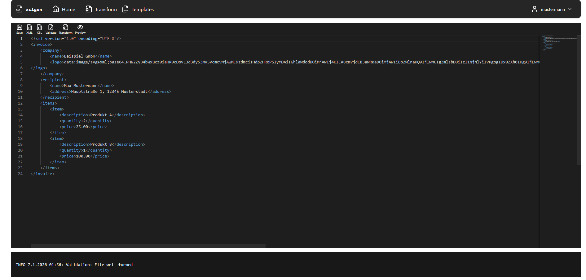

# xslgen

**xslgen** ist ein Tool zum schnellen Testen und Validieren von **XML + XSL(-FO)** mit **PDF-Preview im Browser**.

Der Fokus liegt auf:
- direktem Editieren von XML/XSL
- sofortigem Regenerieren & Anzeigen der PDF-Ausgabe

---

## ✨ Features

- ✏️ **XML / XSL Editor im Browser**
- 📄 **PDF Preview (XSL-FO → PDF)**
- 🔁 **PDF neu generieren**
- 🔐 **JWT-basierte Authentifizierung**
- ⚡ **Schnelles Feedback**

---

## 🖼 Editor & PDF Preview

> Fokus des Projekts: Editor + Live-PDF-Vorschau

---

## 🧱 Tech Stack

### Frontend
- **Angular** (Standalone Components)
- **Tailwind CSS**
- **RxJS**
- **Lucide Icons**

### Backend
- **Spring Boot**
- **Spring Security**
- **JWT Authentication**
- **JPA / Hibernate**

### Persistence
- **PostgreSQL**

### Transformation
- **Apache FOP** (XSL-FO → PDF)

---

## 🧠 Architektur (kurz)

- Frontend kommuniziert ausschließlich über REST
- JWT wird per HttpInterceptor automatisch gesetzt
- PDF wird als Blob geladen (Auth-kompatibel)
- Runtime-Dateien liegen außerhalb von Git

---

## 📌 Zielgruppe

- Leute, die mit **XML/XSL-FO** arbeiten
- Tool zum schnellen Prototyping & Debugging von XSL-Layouts

---

## 📜 Lizenz

MIT
